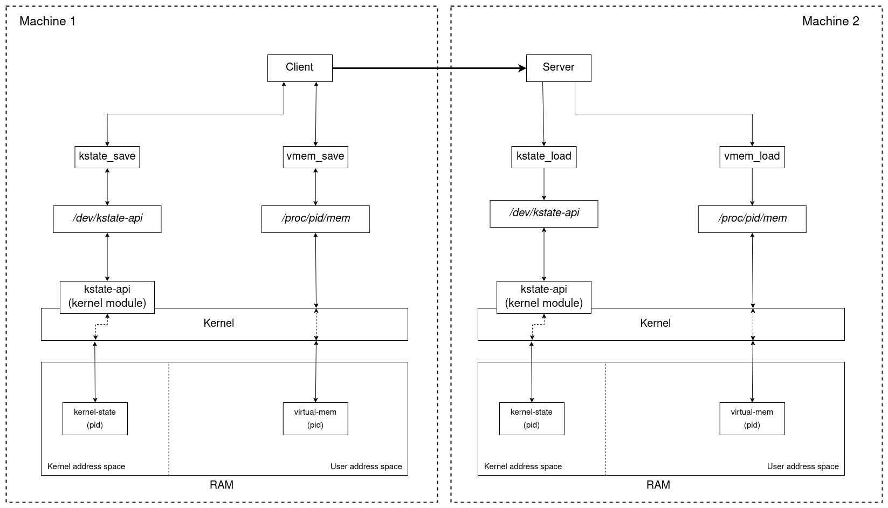
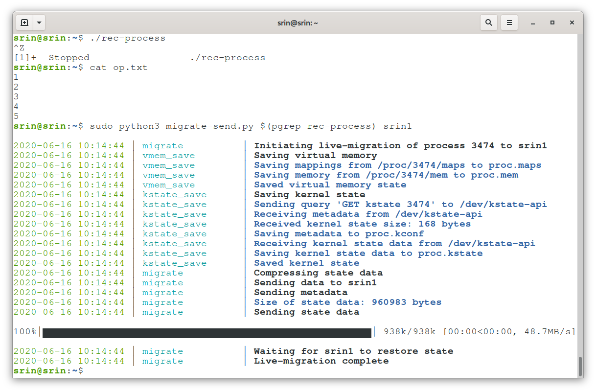
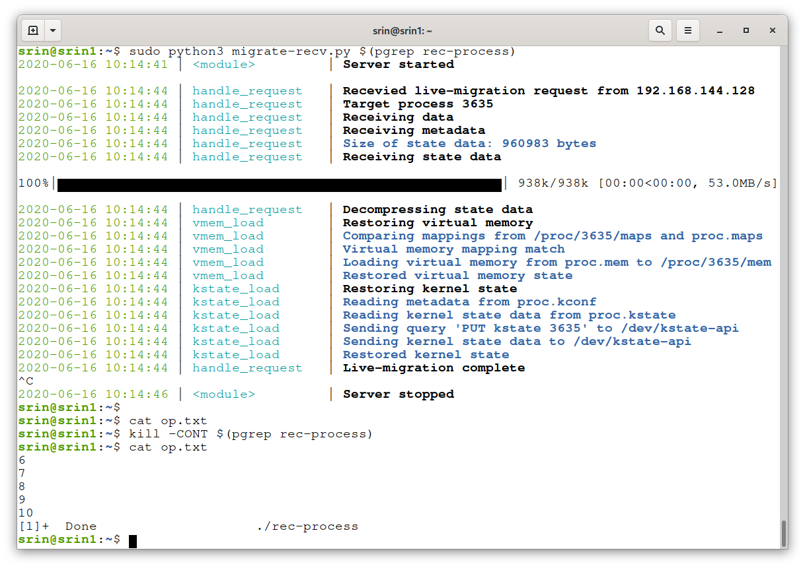

# process-migration-system
## System Design

## Demo
#### Migration source

#### Migration target

## Level of Process Migration Achieved
  * The Iterative and Recursive program.
    * It is successfully migrated from one machine to another with same Operating System(Linux) and same Kernel Version.
    * Virtual Memory Mapping:
      * A user space script is implemented which suspends the process in the current machine and transfers the virtual memory mapping to another machine.The               process is then resumed in the machine.
      * The transfer is achieved using socket programming.
    * Kernal State:
      * A kernel module is also developed to modify the kernel data structures in order to transfer the process control block information, mainly the CPU                   registers.
      * the transfer is acheived using socket programming.
  * An informative Comman line Interface is developed to display the current state of process migration and along with some details.
